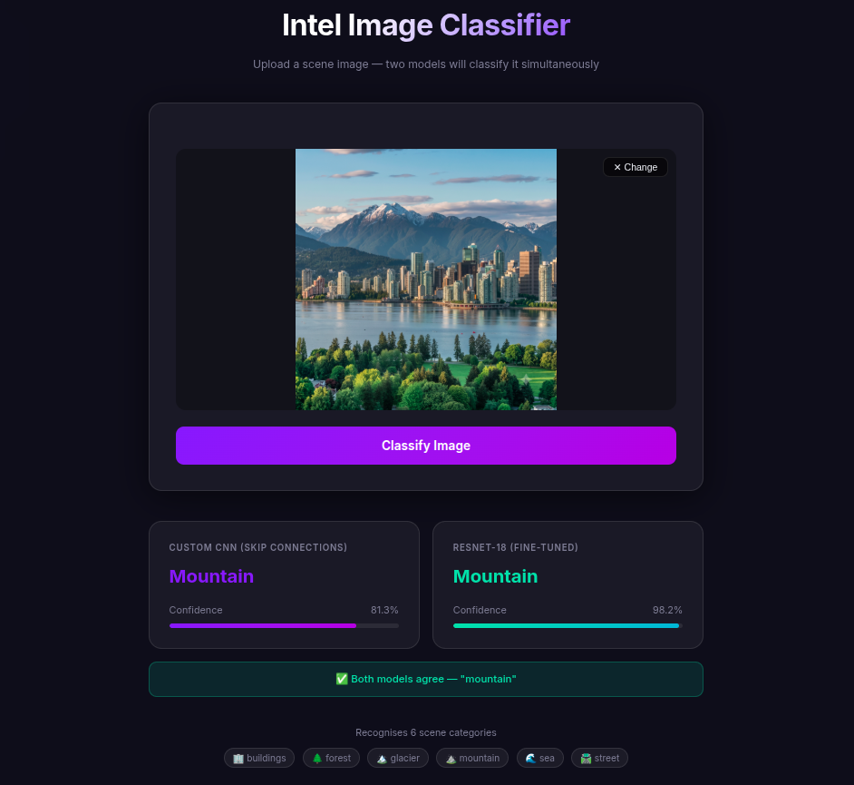

# 🏔️ Intel Image Classifier — POC

> *"The current generation is so deep inside their monitors they've forgotten what the outside world looks like."*
> — the original README, which was painfully correct

So we built a thing that tells you what the outside world looks like. You're welcome.



*Both models agreed it's a mountain. Confidence: very yes.*

---

## What is this?

A **proof-of-concept** scene classifier trained on the [Intel Image Classification](https://www.kaggle.com/datasets/puneet6060/intel-image-classification) dataset.
You throw it a photo. It tells you if you're looking at a building, a forest, a glacier, a mountain, the sea, or a street. That's it. No more, no less.

Two models run in parallel and you get both answers so you can watch them agree (or argue):

| Model | What it is | Trainable params | Best train acc | Best val acc |
|:------|:-----------|:----------------:|:--------------:|:------------:|
| **Custom CNN** | 3-block CNN with a residual (skip) connection in block 2 | 42,732,614 | 96.16% | 86.40% |
| **ResNet-18** | Pretrained on ImageNet, fine-tuned on this dataset | 11,179,590 | 99.35% | **93.73%** |

Spoiler: ResNet wins. Turns out 14 million images of ImageNet pre-training is kinda useful. Who knew.

---

## ⚠️ Before you do anything: get the data & weights

Here's the part where I apologise in advance.

The `data/` and `models/` folders in this repo are empty. Not a git-lfs thing, not a CI secret thing — the dataset is 400 MB and the weights are large enough that GitHub looked at me funny when I tried to push them. So you need to generate both yourself. It takes about 5 minutes of setup and then some GPU time while you go make tea.

### Step 1 — Download the dataset

Head to Kaggle and grab the **Intel Image Classification** dataset:
👉 https://www.kaggle.com/datasets/puneet6060/intel-image-classification

Unzip it into the `data/` folder so the structure looks like this:

```
data/
└── intel-image-classification/
    ├── seg_train/
    │   └── seg_train/
    │       ├── buildings/
    │       ├── forest/
    │       └── ... (6 classes)
    ├── seg_test/
    │   └── seg_test/
    └── seg_pred/
        └── seg_pred/
```

Yes, the nested `seg_train/seg_train/` is intentional and not a typo. Kaggle did that. We don't ask why.

### Step 2 — Run the training notebook

Open `torch05.ipynb` and run it top to bottom. It trains all the models, compares them, and at the very end saves the two weights you actually need:

```
models/torch05_cnn_skip_state_dict.pth
models/torch05_rn_state_dict.pth
```

The notebook runs for a while (15 epochs × 2 models — grab that tea). A GPU helps a lot here. CPU will work but you might age slightly.

Once those two `.pth` files exist in `models/`, you're ready to run the app.

---

## Running the app — pick your poison

### Option A · Bare metal (fast, you already have Python)

```bash
# 1. cd into this directory
cd torch05/

# 2. create a venv (don't skip this, I know you want to)
python -m venv .venv
source .venv/bin/activate          # Windows: .venv\Scripts\activate

# 3. install deps
pip install -r requirements.txt

# 4. start the server
uvicorn app:app --host 0.0.0.0 --port 8000

# 5. open your browser
#    http://localhost:8000
```

The server loads both models at startup — on CPU this takes ~5 s, on GPU ~2 s.
Once it says `Application startup complete`, you're live.

---

### Option B · Docker (reproducible, no "works on my machine" drama)

```bash
# build
docker build -t intel-classifier .

# run  (mount your trained models in — they aren't in the image)
docker run -p 8000:8000 -v $(pwd)/models:/app/models intel-classifier

# open
#   http://localhost:8000
```

> **Note:** The Dockerfile installs the CPU-only build of PyTorch to keep the image size sane (~1.5 GB instead of ~5 GB). If you want GPU inference inside Docker, swap the `--index-url` line in the Dockerfile for the CUDA wheel URL from [pytorch.org](https://pytorch.org/get-started/locally/).

---

## Project layout

```
torch05/
├── app.py                  ← FastAPI backend (this is the one that runs)
├── static/
│   ├── index.html          ← The frontend. One HTML file. No npm. You're safe.
│   └── demo.png            ← That screenshot above
├── models/                 ← Empty on GitHub. Fill it by running the notebook.
├── data/                   ← Also empty on GitHub. Fill it from Kaggle.
├── requirements.txt
├── Dockerfile
└── torch05.ipynb           ← Training notebook. Start here if models/ is empty.
```

---

## Using the UI

1. Open `http://localhost:8000`
2. Drag & drop an image (or click to browse) — JPG / PNG / WEBP all work
3. Hit **Classify Image**
4. Watch both models give their verdict with confidence bars
5. Green banner = they agree. Amber banner = they're arguing. Either way you get an answer.

---

## Using the API directly

If you'd rather skip the pretty UI and go raw:

```bash
curl -X POST http://localhost:8000/predict \
     -F "file=@/path/to/your/image.jpg"
```

Response:
```json
{
  "cnn": { "prediction": "mountain", "confidence": 81.3 },
  "rn":  { "prediction": "mountain", "confidence": 98.2 }
}
```

Interactive docs (because FastAPI gives you these for free): `http://localhost:8000/docs`

---

## Classes

The model recognises exactly these 6 scene categories:

🏢 `buildings` · 🌲 `forest` · 🏔️ `glacier` · ⛰️ `mountain` · 🌊 `sea` · 🛣️ `street`

---

## What this is NOT

- ❌ Production-ready (it's a POC, hence the name)
- ❌ Fine-tuned for edge cases (glaciers and snowy mountains confuse it sometimes — fair enough, they confuse people too)
- ❌ A real product (yet)

## What this IS

- ✅ A working end-to-end POC — training → saved weights → inference → API → UI
- ✅ A good baseline to show the approach works
- ✅ Something you can actually demo without opening a Jupyter notebook in front of people

---

*If it gets something obviously wrong, that's a known limitation of the training data, not a bug. File it under "future work" and move on with your life.*

---

<sub>This README was written by [Antigravity](https://deepmind.google/technologies/gemini/) — Google DeepMind's AI coding assistant. The human just said *"make it humorous, for they are busy ppl"* and went back to training models. Accurate delegation.</sub>
